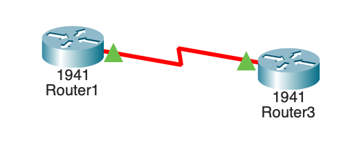
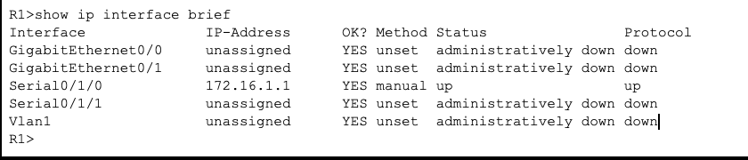
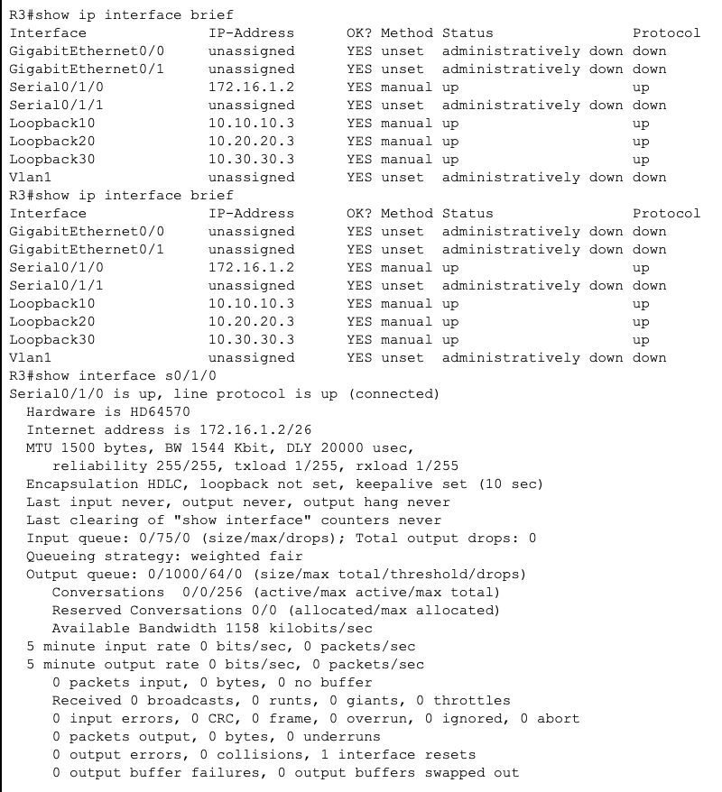

# Lab Name: Configure, Verify, and Troubleshoot IPv4 Addresses

**Date:** 9-6-2025. 

**Packet Tracer Version:** 8.2.2. 

**Objective:** To create and troubleshoot IPv4 addresses using the CLI.  

## 1. Topology Diagram

## 2. IP Addressing Scheme

| Device    | Interface     | IP Address     | Subnet Mask      | Default Gateway|
| :-------- | :------------ | :------------- | :--------------- | :------------- |
| Router1   | S0/1/0 (DCE)  | 172.16.1.1     | 255.255.255.192  | N/A            |
| Router1   | S0/1/0 (DCE)  | 172.16.1.2     | 255.255.255.192  | N/A            |

## 3. Configuration Snippets

## 4. Commands Used

- en
- config t
- hostname "name"
- show ip interface breif
- interface s0/1/0
- ip add "ip address" "subnet mask"
- no shut
- interface lo10
- show interface s0/1/0

